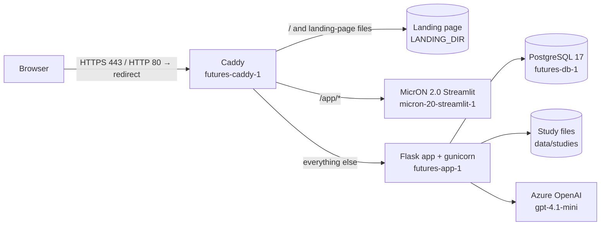

# Deployment guide: futures.conversational-care.ai

This document explains how the study platform runs with Docker, where the data
lives, how to operate and back it up, and what was changed to get it ready.
No secrets are written here; they live only in `.env` on the server.

> **Status (10 Sep 2026):** live at <https://futures.conversational-care.ai>
> on the Azure VM `51.145.93.30`, from `/home/futures/prompt_agent` (local branch
> `dev`, changes not committed yet).

- Participant link of the bundled study: <https://futures.conversational-care.ai/south_asia>
- Admin: <https://futures.conversational-care.ai/admin> (password: `ADMIN_PASSWORD` in `.env`)
- How to use the app: [docs/USER_MANUAL.md](docs/USER_MANUAL.md)

---

## 1. What runs where



| Container | Image | Role | Reachable from |
|---|---|---|---|
| `futures-caddy-1` | `caddy:2-alpine` | HTTPS (Let's Encrypt), reverse proxy, landing page | internet, ports 80/443 |
| `futures-app-1` | `futures-app:latest` (this repo's `Dockerfile`) | Flask app on gunicorn (2 workers × 8 threads) | Caddy only |
| `futures-db-1` | `postgres:17-alpine` | answers, transcripts | app only |
| `micron-20-streamlit-1` | `micron-2.0` (other repo) | MicrON 2.0 at `/app/` | Caddy only, through the `futures-edge` network |

Routing is defined in [deploy/caddy/Caddyfile](deploy/caddy/Caddyfile):

1. `/` and files that exist in `LANDING_DIR` → the static landing page
   ("Thinking about the future of healthcare"). If `LANDING_DIR` has no
   `index.html`, `/` is served by the app instead.
2. Any `deploy/caddy/conf.d/*.caddy` file (server-specific). On this server
   `micron.caddy` sends `/app/*` to MicrON.
3. Everything else → the Flask app (`/<study_id>`, `/admin`, ...).

## 2. Persistent data

Everything that must survive lives on the host under `DATA_DIR` (default
`./data`, git-ignored):

| Host path | Contents |
|---|---|
| `data/postgres/` | PostgreSQL database (owned by uid 70, the postgres user in the container) |
| `data/studies/<study_id>/` | `<study_id>.json`, the six images, `pis.pdf` (created/edited from `/admin`) |
| `data/caddy/` | TLS certificates and Caddy state |
| `backups/` | nightly backups (see §6) |

These are bind mounts, so they are **not** affected by `docker compose down`,
`down -v`, rebuilding images or recreating containers. Only deleting the folders
removes data.

Verified on 10 Sep 2026 on the live server: a study created through `/admin`
(with image and PDF uploads) and all database rows survived
`docker compose restart`, `docker compose down` + `up -d`, and
`docker compose up -d --build --force-recreate`. The certificate was reused and
no new one was requested.

On the first start the app copies the bundled studies listed in `SEED_STUDIES`
(default `south_asia`) into `data/studies/`. After that the data folder is the
source of truth: editing `south_asia/` in git does **not** change the live
study. Use `/admin` → Edit, or delete `data/studies/south_asia` and restart to
re-seed it.

## 3. First-time setup on a new server

1. Install Docker Engine with the compose plugin.
2. Point the domain's DNS `A` record at the server and open ports 80 and 443.
3. Clone the repository and create the configuration:

   ```bash
   git clone <repo> prompt_agent && cd prompt_agent
   cp .env.example .env
   python3 -c "import secrets; print(secrets.token_hex(32))"   # FLASK_SECRET_KEY
   python3 -c "import secrets; print(secrets.token_hex(24))"   # POSTGRES_PASSWORD
   nano .env        # DOMAIN, secrets, ADMIN_PASSWORD, LLM settings
   chmod 600 .env
   ```

4. Start everything:

   ```bash
   docker compose up -d --build
   docker compose ps          # all three containers "healthy"/"Up"
   curl -s https://<your-domain>/healthz   # {"status":"ok"}
   ```

Caddy obtains the certificate automatically on the first HTTPS request.

## 4. Configuration (`.env`)

All variables are explained in [.env.example](.env.example). The important ones:

| Variable | Notes |
|---|---|
| `DOMAIN` | `futures.conversational-care.ai` |
| `LANDING_DIR` | here `/home/futures/MicrON-2.0/web`; empty = app's own home page |
| `FLASK_SECRET_KEY`, `ADMIN_PASSWORD`, `POSTGRES_PASSWORD` | generated secrets |
| `USE_AZURE=true` + `AZURE_OPENAI_ENDPOINT`, `AZURE_OPENAI_API_KEY`, `AZURE_OPENAI_API_VERSION`, `AZURE_OPENAI_DEPLOYMENT` | current set-up (UK resource, deployment `gpt-4.1-mini`) |
| `USE_AZURE=false` + `OPENAI_API_KEY` (+ `OPENAI_MODEL`) | use the OpenAI API instead |
| `SEED_STUDIES` | bundled studies copied on first start |

The Azure resource also has `gpt-4.1` and `gpt-5.4` deployments. Change
`AZURE_OPENAI_DEPLOYMENT` to switch models.

After editing `.env`: `docker compose up -d` (recreates what changed).

## 5. Day-to-day operations

Run these from `/home/futures/prompt_agent`:

```bash
docker compose ps                       # status
docker compose logs -f app              # app logs (add caddy / db as needed)
docker compose restart app              # restart the app only
docker compose up -d --build            # deploy code changes (after git pull)
docker compose down                     # stop everything (data is kept)
docker compose up -d                    # start again
scripts/test.sh                         # run the automated tests (separate test DB)
scripts/backup.sh                       # take a backup now
docker compose exec db sh -c 'psql -U "$POSTGRES_USER" -d "$POSTGRES_DB"'   # SQL shell
```

`docker compose down` prints `Network futures-edge Resource is still in use`
while MicrON is attached to that network. That is expected and harmless.

Containers use `restart: unless-stopped`, so they come back after a reboot.
Container logs are rotated (5 × 10 MB per container).

Answers can be read and downloaded (CSV/JSON) from `/admin/responses`; no
database access is needed for that.

## 6. Backups and restore

- `scripts/backup.sh` writes `backups/<timestamp>/database.dump` (pg_dump,
  custom format) and `studies.tar.gz`, and keeps the newest 14 (`KEEP=30` to
  change).
- A cron job runs it every night at 03:15 (server time) for the `futures` user:
  `crontab -l` shows it and the log goes to `backups/backup.log`.
- Backups stay on the same VM. Copy them elsewhere if the data matters (see
  decisions, §10).

Restore:

```bash
# database (replaces the current tables)
docker compose exec -T db sh -c 'pg_restore -U "$POSTGRES_USER" -d "$POSTGRES_DB" --clean --if-exists' \
  < backups/<timestamp>/database.dump
# study files
tar -xzf backups/<timestamp>/studies.tar.gz -C data/
docker compose restart app
```

A restore of the first backup into a scratch database was tested successfully.

## 7. HTTPS, Caddy and MicrON on this server

Before this deployment, MicrON-2.0's own Caddy served the domain (landing page
at `/`, Streamlit at `/app`). To keep both working, only one Caddy can hold ports
80/443, so:

- **This stack's Caddy now serves the domain.** The existing Let's Encrypt
  certificate was copied from MicrON's Caddy volume, so no new certificate was
  requested. Renewal is automatic.
- **The landing page** is served from `LANDING_DIR=/home/futures/MicrON-2.0/web`.
- **MicrON** keeps running at `/app/`:
  - `deploy/caddy/conf.d/micron.caddy` (git-ignored; a copy of
    `micron.caddy.example`) proxies `/app*` to `micron:8501`.
  - In `/home/futures/MicrON-2.0/docker-compose.yml` (not part of this repo), the
    `streamlit` service joined the external `futures-edge` network with the
    alias `micron`, and the old `caddy` service was moved to the `standalone`
    profile so it no longer starts. Its certificate volume was kept.
- Security headers added by Caddy: HSTS, `X-Content-Type-Options: nosniff`,
  `Referrer-Policy`. Session cookies are `Secure; HttpOnly; SameSite=Lax`.

**Roll back to the previous set-up** (MicrON's Caddy serving everything):

```bash
cd /home/futures/prompt_agent && docker compose stop caddy
cd /home/futures/MicrON-2.0 && docker compose --profile standalone up -d caddy
```

**Retire MicrON completely:** remove `deploy/caddy/conf.d/micron.caddy`, run
`docker compose restart caddy` here, then `docker compose down` in
`/home/futures/MicrON-2.0`. Set `LANDING_DIR=` if the landing page should go too.

## 8. What changed in the code

**Deployment (new):** `Dockerfile`, `docker-compose.yml`,
`docker/entrypoint.sh` (prepares and seeds the data folder, drops root),
`docker/gunicorn.conf.py`, `deploy/caddy/Caddyfile`, `.env.example`,
`.dockerignore`, `scripts/backup.sh`, `scripts/test.sh`, `/healthz` endpoint.

**Database: Supabase replaced by PostgreSQL** (`backend/db.py`):

- The `answers` table is created automatically:
  `id, user_id, study, created_at, updated_at, consent, name, age, gender,
  community, agent_language, usecase, scenario, initial, context, final,
  chatbot_summary (JSON), transcript (JSON), completed_at`.
  The former `Age` / `Gender` / `Community` columns are now lowercase.
- **New:** the full chat transcript is saved, plus the completion time.
- The chat history used to live in the browser cookie. Cookies are capped at
  about 4 KB, so a normal interview could overflow it; the browser then drops the
  session and the participant gets locked out ("Prolific ID already used").
  Now the history is kept in the database and the cookie only holds IDs (tested
  with a 21-message conversation).
- `DATABASE_URL` can point at any PostgreSQL instead of the container.

**Study storage** (`backend/studies.py`): studies live in `STUDIES_DIR`
(`data/studies` in Docker), which fixes the read-only-filesystem problem from
Vercel. In addition:

- Files are written atomically.
- Uploaded images are checked and converted to JPEG (max 2000 px); PDFs are
  checked too.
- Study IDs are validated. Reserved IDs such as `admin` and `app` are rejected,
  and creating a study with an existing ID no longer silently overwrites it.
- Settings the form does not manage are kept when a study is edited.
- Only images and `pis.pdf` are served publicly; the study JSON is not.

**LLM** (`PromptBasedAgent.py`, `backend/agent_service.py`):

- `USE_AZURE` switches between Azure OpenAI and OpenAI, with a 60 s timeout and
  2 retries.
- Errors are logged instead of being shown to participants (they used to see
  `⚠️ Error: <exception>`), and the participant's message is kept so they can
  press Send again.
- The Prolific ID is no longer sent to the model.
- The model now also receives the scenario's short description, "what it does"
  and "imagine" sentence, and the use case description. Before, it only knew the
  scenario name, e.g. "Safety".
- A Markdown code fence before the final JSON is handled.

**Participant flow fixes** (`app.py`, `web/index.html`, `web/chat.html`):

- The opening message was generated before the chosen scenario and questions
  were saved, so the assistant did not know them. It now uses them.
- Leaving gender or community unselected caused a "400 Bad Request" page.
  Options now submit fixed English values in every language.
- The **Back** button on the scenario page caused a "400 Bad Request". It is now
  a link, and the use case page has a Back button too.
- Switching language on the scenario page showed empty cards.
- The intro text on the first page showed undefined variables
  (`{{study_group}}`, `{{counrty}}`). It now shows the study's header and intro
  text.
- Images on the chat page used relative URLs that broke (`/south_asia/south_asia/city.jpg`).
- Reloading a page re-submitted forms. Every form now redirects after saving.
- Scenario cards were labelled "Use case one/two/three". They now say
  "Scenario one/two/three" and also show the short description and
  "what it does" text.
- New: a completion screen when the interview ends, with an optional "Finish and
  return to Prolific" button (new **Completion URL** study field). Participants
  cannot continue or change scenario after completing.
- Choosing a different scenario or use case starts a fresh conversation.
- New: the Prolific `PROLIFIC_PID` URL parameter pre-fills the Prolific ID.
- New: a "Preparing your conversation…" overlay, a typing indicator, Enter to
  send (Shift+Enter for a new line), and a multi-line message box.
- The participant's own chat messages have readable contrast.
- On phones the information sheet opens as a button, because phone browsers
  cannot show embedded PDFs.
- A placeholder is shown instead of a broken image when a study image is
  missing.
- A friendly 404 page for unknown studies.

**Admin:**

- **New:** a Responses page, a per-participant transcript view, CSV and JSON
  export, and a delete button that also frees the Prolific ID for test runs.
- **New:** a logout button and CSRF protection on all admin forms.
- The studies list shows the full participant link, started/completed counts and
  any missing files.

**Translations:** the Spanish catalogue is 100 % translated (179 strings). Two
existing errors were fixed ("Update study" said "Crear estudio", "Estos
variable…"). The catalogue is now compiled during the Docker build; `*.mo` files
are git-ignored, so before this Spanish never actually showed on a fresh
deployment.

**Tests:** 20 automated tests (`tests/`, run with `scripts/test.sh`) cover:

- the full participant flow and its validation
- persistence of the answers
- LLM outage handling
- the cookie size
- admin create/edit, upload validation, exports and delete.

**Dependencies:** `requirements.txt` is pinned. Removed: `supabase`, and
`streamlit`, which only the old `app_st.py` prototype used; run
`pip install streamlit` to use that file. Added: `gunicorn`, `psycopg`,
`pillow`.

## 9. Gaps that were filled — please check

| What | Why | Action |
|---|---|---|
| `south_asia/city.jpg`, `scenario-one.jpg`, `scenario-two.jpg`, `scenario-three.jpg` are **generated placeholder illustrations** (simple flat drawings in the site's colours: city skyline, personal companion, alert/safety, family together) | These four images never existed in the repository (they also returned 404 on the Vercel site) | Replace with the real artwork via **Admin → Edit** (south_asia). Scenario images are shared by both use cases (1 = self care, 2 = safety, 3 = connection). |
| ~115 new Spanish translations | New and previously untranslated strings (admin, consent page, errors) | A native speaker should review `translations/es/LC_MESSAGES/messages.po` |
| South Asia study has no **Completion URL** | Field did not exist before | Add the Prolific completion link in Admin → Edit, otherwise participants see "You can now close this window." |
| Only `south_asia` is seeded | `example/` is a template and `south_america/` has placeholder text ("Header", "Hello") and no images or PDF | Set `SEED_STUDIES=south_asia,south_america` if you want it |
| The landing page and MicrON 2.0 were kept at `/` and `/app/` | The domain already served them; nothing was switched off | See decision 1 |
| Admin password, database password and secret key were generated | Needed for the deployment | Stored in `.env` on the server only |

## 10. Decisions to make

1. **Keep the landing page at `/` and MicrON at `/app/`?** Both are kept for now.
   The rollback and retire steps are in §7.
2. **Stock photo licence:** `south_asia/usecase-two.jpg` shows a visible
   **Adobe Stock watermark** (#216687168), so it is a preview (comp) image that
   should not be shown to real participants unless licensed. Please also check the
   source/licence of `usecase-one.jpg`.
3. **Prolific ID policy:** an ID can be used only once, across all studies. If a
   participant loses their session (for example a different browser or device),
   they cannot come back. Options: keep this, or allow resuming an unfinished
   interview in the same study.
4. **Prompt wording (research instrument):**
   - Q1 is built as "What do you most like about this idea to" + use case, which
     reads oddly ("…idea to Taking care of yourself?").
   - The use case's own "initial question" from the admin form is only offered to
     the model as an optional opening.
   - The model now receives the scenario descriptions, but the prompt does not
     tell it to mention them.
5. **Personal data and ethics:**
   - The participant's name is sent to Azure OpenAI (the prompt greets them by
     name). The Azure resource is in the UK.
   - Names, demographics and transcripts are stored in PostgreSQL on this VM.
   - Please confirm this matches the ethics approval and data-management plan
     (retention, who has admin access, Azure data-handling settings), and decide
     whether to collect only a first name or nickname.
6. **Off-site backups:** backups currently stay on the same VM. Copy them to
   university storage or an Azure storage account if this will hold real data.
7. **Rotate the Azure OpenAI key.** It was shared in plain text by email/chat.
   After rotating, update `AZURE_OPENAI_API_KEY` in `.env` and run
   `docker compose up -d`.
8. **Multilingual study content:** the interface is translated and the assistant
   replies in the chosen language, but use case and scenario texts are
   single-language. Running a study in Spanish or Portuguese needs those texts
   translated (one config per language, or a new per-language field).
9. **Smaller items:**
   - The `User IDs` field in the admin form is not used by the app (remove it, or
     use it as an allow-list of test IDs?).
   - The thread ID is shown to participants.
   - The accepted age range is 1–120 (should it be 18+?).
   - There is no "delete study" button yet.
10. **Vercel:** the Vercel deployment still has the read-only problem for study
    creation and would now need `DATABASE_URL` instead of Supabase. Suggest
    retiring it in favour of this server.
11. **Model choice:** currently `gpt-4.1-mini`; `gpt-4.1` and `gpt-5.4` are also
    deployed on the Azure resource.

## 11. Security notes

- Secrets live only in `.env` (mode 600, git-ignored). Never commit it.
- Only Caddy is published. The app and database are on an internal Docker
  network.
- Admin access:
  - password protected, with a 1 s delay after a wrong password
  - sessions last 24 h
  - CSRF tokens on every admin form
- Uploads: 50 MB request limit; images are re-encoded; PDFs are checked.
- The app runs as an unprivileged user inside its container.

## 12. Troubleshooting

| Symptom | Check |
|---|---|
| Site not reachable | `docker compose ps`, `docker compose logs caddy` (ports 80/443 must be free: `docker ps` should not show another Caddy) |
| "Sorry, the assistant could not reply" | `docker compose logs app \| grep "Agent call failed"`: key, quota or deployment name in `.env` |
| "Admin password is not configured" | `ADMIN_PASSWORD` missing in `.env`, then `docker compose up -d` |
| Uploaded study not visible | `ls data/studies/<id>`; it needs `<id>.json` |
| Certificate problems | DNS must point to this server; `docker compose logs caddy` |
| Database connection errors | `docker compose logs db`; `POSTGRES_*` in `.env` must match the ones used when `data/postgres` was created |
