# AI Futures: user manual

Site: <https://futures.conversational-care.ai>

This manual covers the participant journey, the admin pages, running a study on
Prolific, and a checklist for demos. Setting up and operating the server is
covered in [DEPLOYMENT.md](../DEPLOYMENT.md).

> Screenshots taken on 10 September 2026. The South Asia study's city and
> scenario pictures are **placeholder illustrations** until the real artwork is
> uploaded (see DEPLOYMENT.md §9).

**Contents**
1. [Participants](#1-participants)
2. [Researchers: the admin pages](#2-researchers-the-admin-pages)
3. [Running a study on Prolific](#3-running-a-study-on-prolific)
4. [Demo checklist](#4-demo-checklist)
5. [Questions and problems](#5-questions-and-problems)

---

## 1. Participants

Participants receive a study link such as
<https://futures.conversational-care.ai/south_asia>.

### 1.1 Information and consent

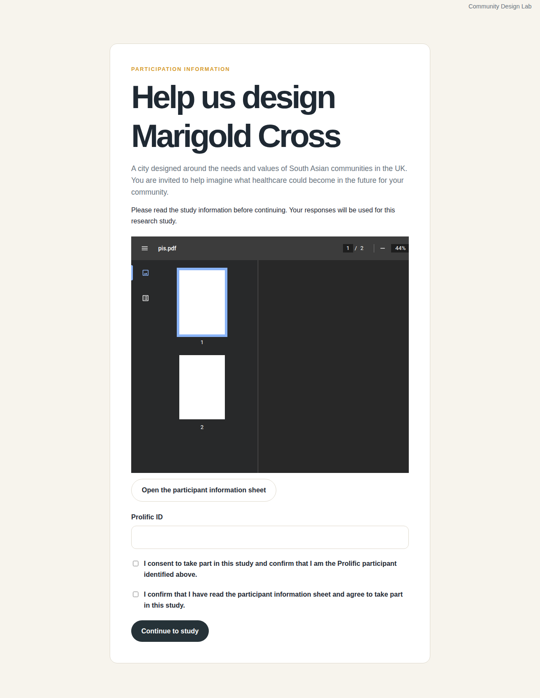

1. Read the participant information sheet. It is shown on the page; **Open the
   participant information sheet** opens it in a new tab. On phones only the
   button is shown.
2. Enter your **Prolific ID**. It is filled in automatically when you arrive from
   Prolific.
3. Tick both boxes and press **Continue to study**.

Each Prolific ID can take part only once.

### 1.2 About you

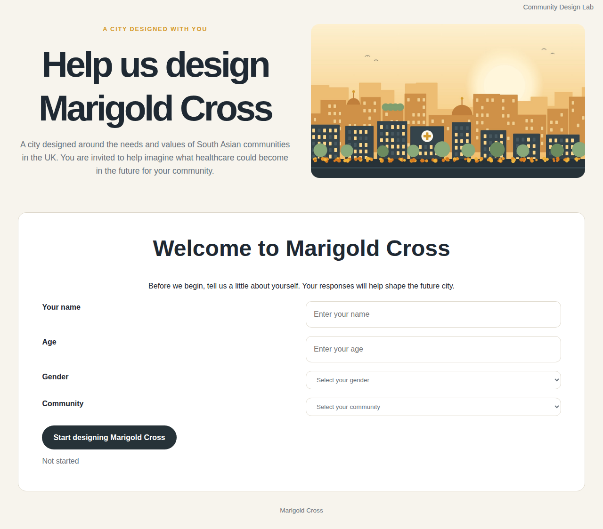

Enter your name and age, choose a gender and community, then press **Start
designing …**. The community list comes from the study settings, plus *Other*
and *Prefer not to say*.

### 1.3 Choose a use case

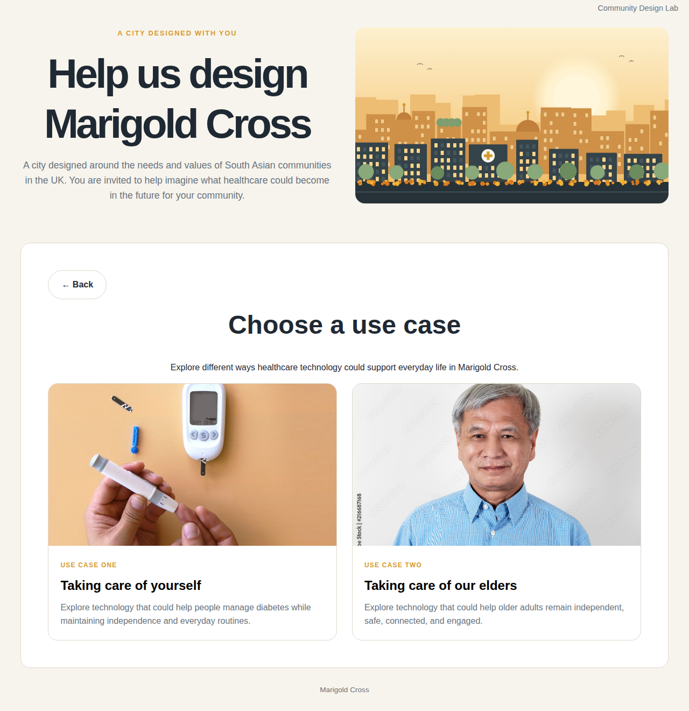

Click one of the two cards. **← Back** returns to the previous step, and your
answers are kept.

### 1.4 Choose an idea (scenario)

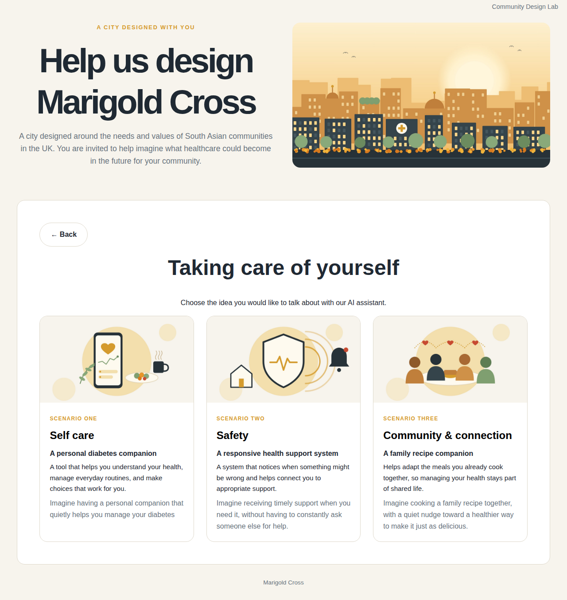

Each card shows the idea's name, a short description, what it does and an
"imagine" sentence. Click the one you would like to talk about. A *Preparing
your conversation…* message shows while the assistant writes its first
question, which usually takes 1–3 seconds.

### 1.5 Talk to the AI assistant

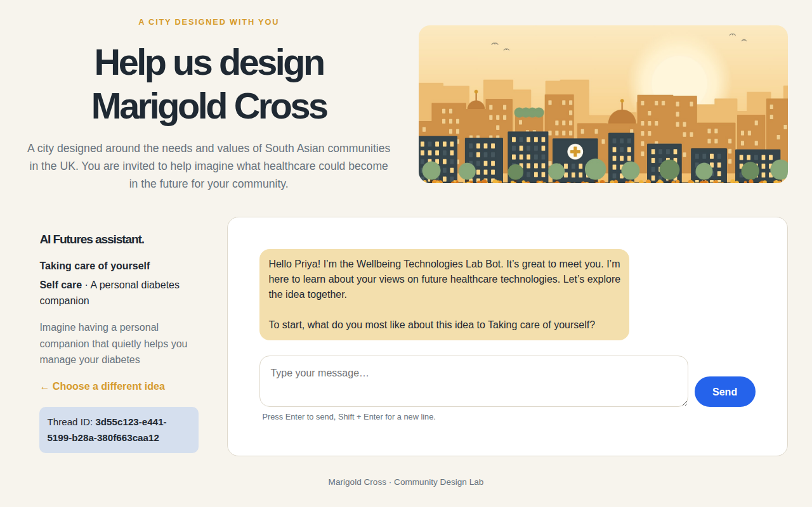

- The assistant greets you by name and asks **six questions, one at a time**.
- Type your answer and press **Send**, or press **Enter**. **Shift + Enter**
  starts a new line.
- While the assistant is replying, your message appears straight away with a
  "…" indicator.
- The left column reminds you which idea you are discussing.
  **← Choose a different idea** goes back to the ideas and starts a new
  conversation.
- If the assistant cannot reply (for example, a network problem), a message says
  so and your text stays in the box. Press **Send** again.

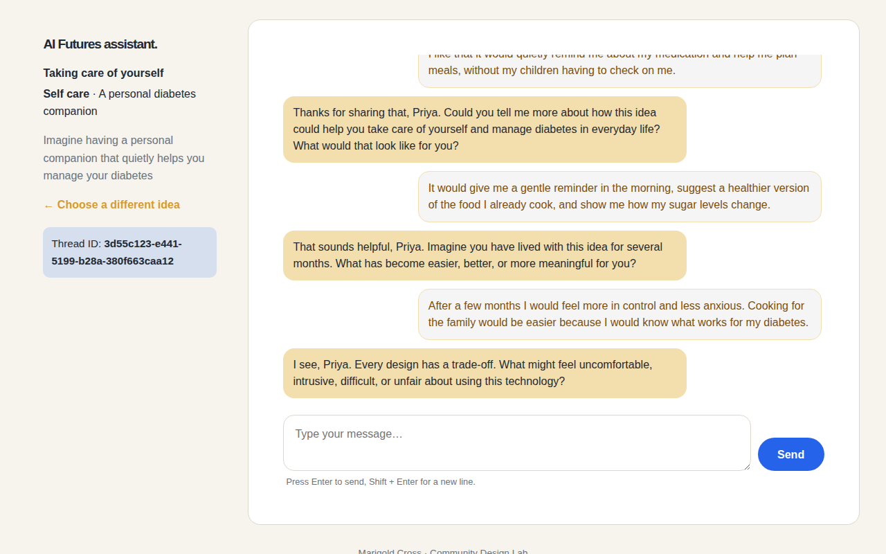

### 1.6 Finishing

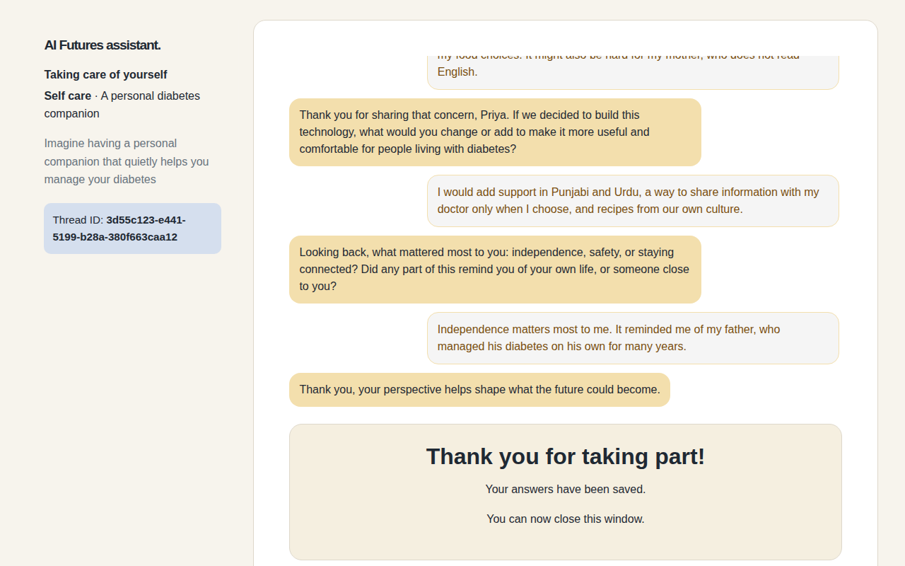

After the last question the assistant thanks you and the conversation is saved.
If the study has a completion link, a **Finish and return to Prolific** button
appears; otherwise the page says you can close the window. A finished
conversation cannot be continued or restarted.

### 1.7 Languages

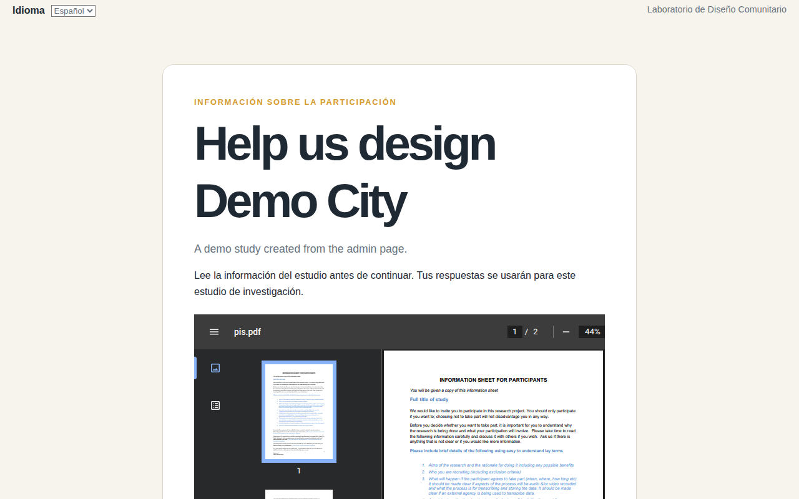

If a study offers more than one language, a **Language** selector appears at
the top left:

- The page texts switch language (Spanish translations are included).
- The AI assistant replies in the selected language.
- The study's own texts (use cases, ideas, questions) are shown as they were
  entered.

### 1.8 On a phone

The pages adapt to small screens.

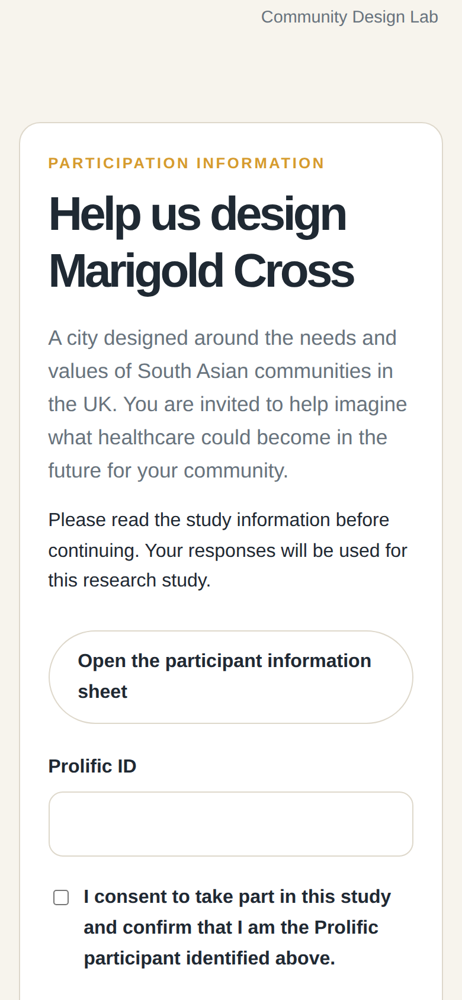 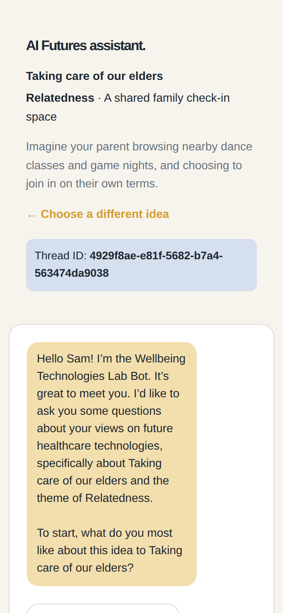

---

## 2. Researchers: the admin pages

### 2.1 Log in

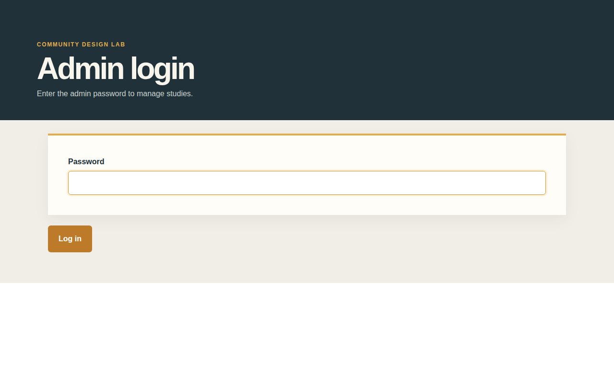

Go to <https://futures.conversational-care.ai/admin> and enter the admin
password; ask the team, it is stored in `.env` on the server. You stay logged in
for 24 hours on that browser. Use **Log out** (top right) on shared computers.

### 2.2 Studies overview

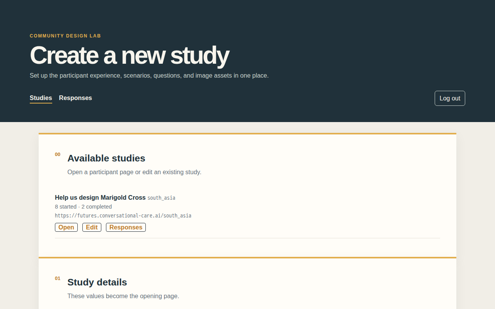

For every study the overview shows:

- its **participant link**, to copy into Prolific
- how many people **started** and **completed**
- a warning if any image or the information sheet is **missing**
- the buttons **Open** (the participant view), **Edit** and **Responses**

Below the list is the form to create a new study.

### 2.3 Create a study

Fill in the form and press **Create study**. Every field is required unless it
says *(optional)*.

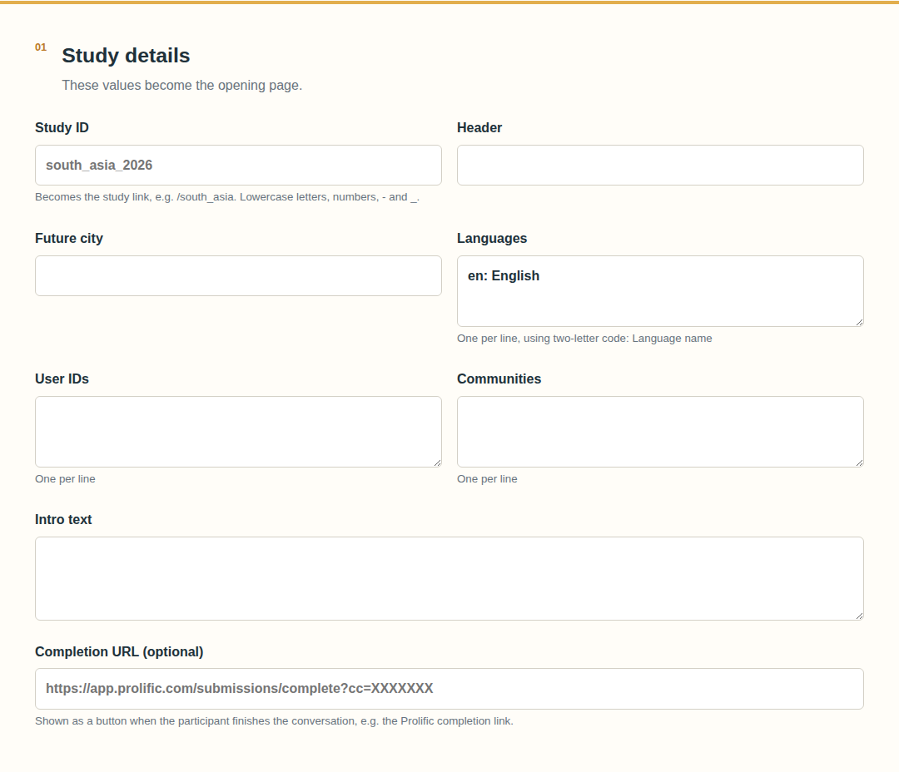

| Field | What it does |
|---|---|
| **Study ID** | Becomes the link, e.g. `south_asia` → `/south_asia`. Lowercase letters, numbers, `-` and `_`. Cannot be changed later; `admin` and `app` are reserved. |
| **Header**, **Future city**, **Intro text** | Shown at the top of the participant pages. |
| **Languages** | One per line as `code: Name`, e.g. `en: English`, `es: Español`. The first one is the default. Interface translations exist for English and Spanish; the assistant can speak any language. |
| **User IDs** | Stored with the study, but not used by the app yet. |
| **Communities** | One per line; the options in the *Community* drop-down. |
| **Completion URL** *(optional)* | Shown as the **Finish and return to Prolific** button at the end, e.g. `https://app.prolific.com/submissions/complete?cc=XXXXXXX`. |

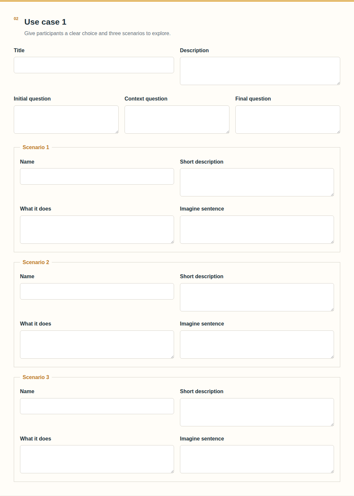

Each study has **two use cases**. For each one:

- **Title** and **Description** appear on the use case card.
- **Initial**, **Context** and **Final** questions are given to the AI assistant.
  In the current prompt the *Context* question is part of question 2 and the
  *Final* question is question 5.
- **Three scenarios.** Each has a **Name** (card title), **Short description**,
  **What it does** and an **Imagine sentence**. All four are shown on the card
  and passed to the assistant.

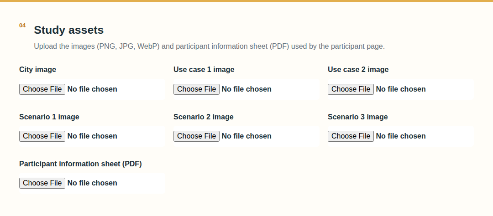

**Assets:**

- the city image (top of every page)
- one image per use case
- three scenario images, shared by both use cases: 1 = first scenario, 2 = second
  and 3 = third of whichever use case was chosen
- the participant information sheet (PDF)

Images can be JPG, PNG or WebP. They are converted to JPEG and resized to at
most 2000 px. Keep the total upload under 50 MB.

After saving, the page confirms it and shows the participant link:

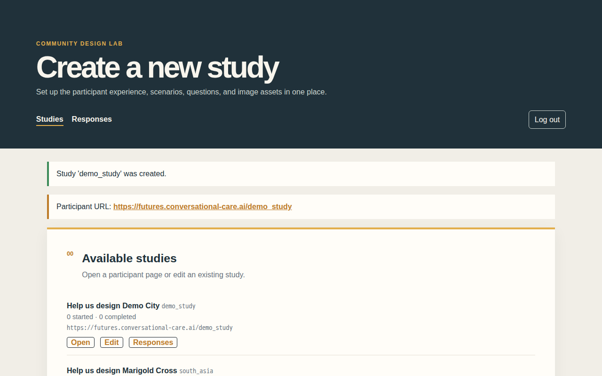

### 2.4 Edit a study

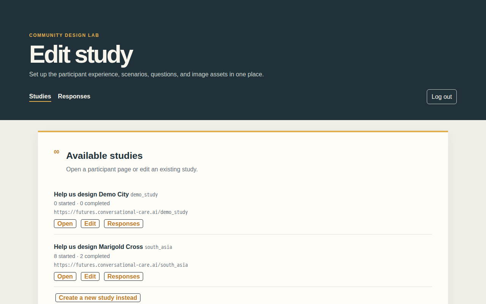

Click **Edit** next to a study, change what you need and press **Update study**:

- Leave a file field empty to **keep the current file**; choose a file to
  replace it.
- The Study ID cannot be changed.
- Changes are visible immediately.

Avoid renaming use cases or scenarios while a study is collecting data, because
participants who are halfway through keep the old names.

### 2.5 Responses and export

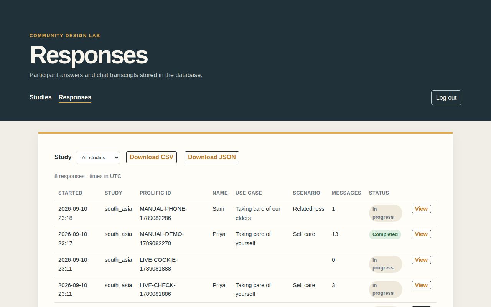

**Responses** lists every participant. Times are in UTC.

- **Filter by study** with the drop-down.
- **Download CSV** or **Download JSON** exports everything, including the full
  conversation and the assistant's summary. The CSV opens in Excel. Cells that
  start with `=`, `+`, `-` or `@` get a leading `'` so spreadsheet programs do
  not treat them as formulas. The JSON is the raw data.
- **View** opens one participant:

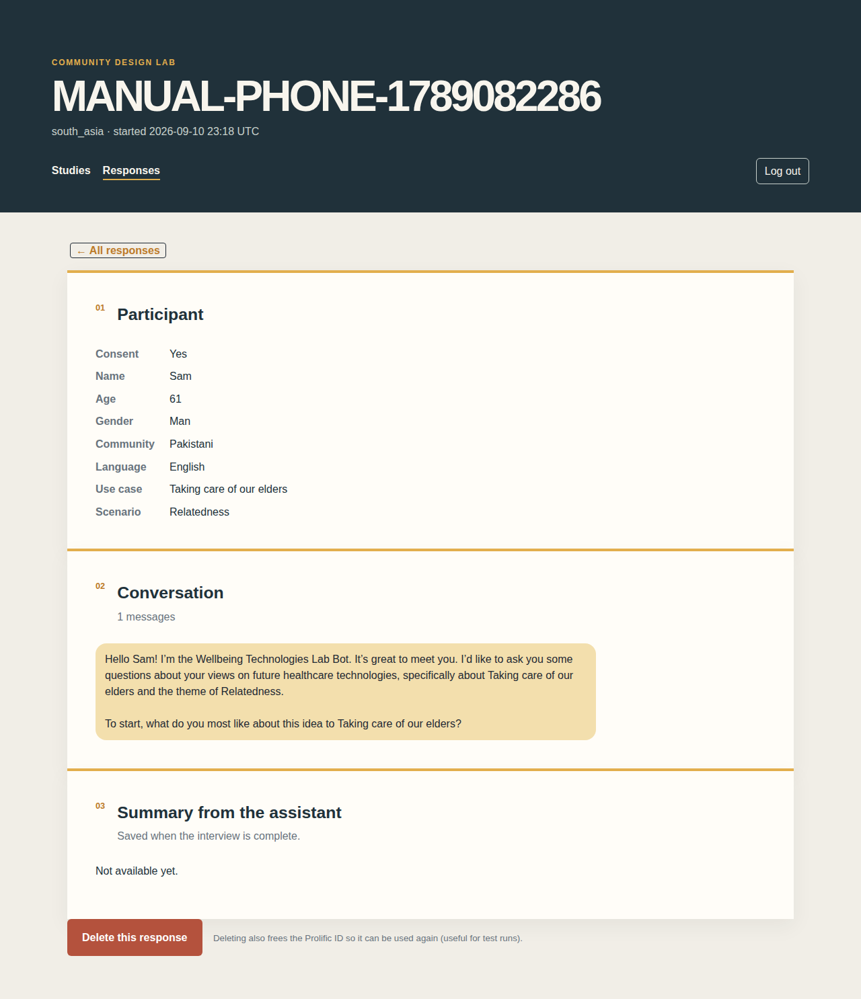

The detail page shows the answers from the *About you* form, the chosen use case
and scenario, the **whole conversation**, and the **summary JSON** that the
assistant produces at the end.

**Delete this response** removes it permanently. It also frees the Prolific ID
so the same ID can be used again, which is useful after test runs.

---

## 3. Running a study on Prolific

1. Create the study in the admin pages and check it with **Open**.
2. In Prolific, set the study URL to the participant link with Prolific's
   parameters, for example:

   ```
   https://futures.conversational-care.ai/south_asia?PROLIFIC_PID={}&STUDY_ID={}&SESSION_ID={}
   ```

   The Prolific ID is then filled in automatically on the consent page.
3. In Prolific, choose to redirect participants back on completion. Copy the
   completion link (`https://app.prolific.com/submissions/complete?cc=…`) into
   the study's **Completion URL** field (Admin → Edit).
4. Run a short pilot with a few test IDs, check **Responses**, then delete the
   test responses.
5. Phones can take part, but they open the information sheet in a separate tab.
   Consider limiting the study to desktop devices in Prolific.

---

## 4. Demo checklist

- Use a private/incognito window for the participant side, so the admin login
  and the participant session don't mix.
- Open <https://futures.conversational-care.ai/south_asia> and use a made-up
  ID such as `DEMO-1`. Each ID works once: use `DEMO-2`, `DEMO-3` and so on, or
  delete the test response to reuse an ID.
- A full interview takes six answers, about 5–10 minutes. Replies usually take
  1–3 seconds.
- To show the researcher side, open **/admin**:
  1. Studies overview.
  2. Edit the South Asia study.
  3. Responses: open the demo conversation and download the CSV.
- Mention that the city and scenario pictures of the South Asia study are
  placeholders.

---

## 5. Questions and problems

| Message or problem | What to do |
|---|---|
| *This Prolific ID has already been used.* | Each ID works once. For tests, delete the old response (Admin → Responses → View → Delete) or use a new ID. |
| A participant closed the browser | Coming back in the same browser within 24 hours continues where they left off. On another browser or device they cannot re-enter with the same ID. |
| *Sorry, the assistant could not reply just now.* | Press **Send** again; the text is kept. If it keeps happening, ask the admin to check the server logs. |
| *Page not found* | Check the study ID in the link. |
| *This form has expired* (admin) | Reload the page and submit again; the admin session probably expired. |
| *Upload too large* | Use smaller images: the whole form must be under 50 MB. |
| The information sheet does not show on the page | Use the **Open the participant information sheet** button. Phone browsers cannot show embedded PDFs. |
